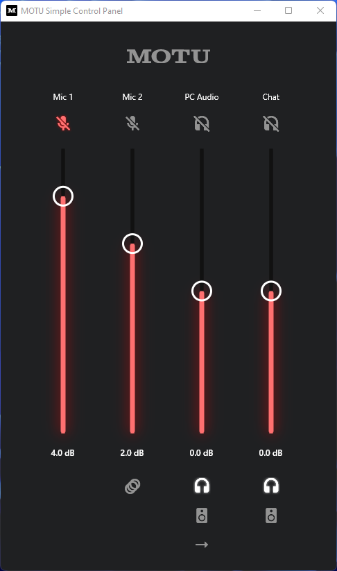

# MOTU Simple Control Panel (Unofficial)




With this project I'm trying to experiment with the [API exposed by my **MOTU UltraLite AVB** audio interface](https://cdn-data.motu.com/downloads/audio/AVB/docs/MOTU%20AVB%20Web%20API.pdf).\
My goal is to create a minimal control panel with just the functionality I use the most, like some volume faders, channel mute, reverb toggle and some audio redirects.

This project was created with just Windows, macOS and Linux support, since I don't intend to run this application on mobile devices.

One thing to keep in mind is that the API gives fader values as float from 0 to 1, where 0 is the bottom of the fader, and 1 is +12dB.\
For this reason I made some utility functions to convert those values to values I can use on sliders, and vice-versa (audio faders are logarithmic).\
Also, I limited the sliders inside this app from -6dB to +6dB, since i don't usually go over or below those values when I make volume adjustments.


## How to run

Setup your Flutter environment to be able to use the new Flutter Desktop capability.\
Refer to the [official Flutter Documentation](https://flutter.dev/desktop) on how to do that.
> Note:
I had to use flutter on the **master** channel since that's the only one that at the time of writing supports **Visual Studio 2022**.

Get the dependencies:
```sh
flutter pub get
```

At the fist start, the app will ask you your MOTU interface API URL, in my case `http://localhost:1280/0001f2fffe012d80/datastore`.\
Remember to keep the `/datastore` at the end, that's the base API endpoint.

Run the application inside Android Studio, or using this command:
```sh
flutter run -d windows
```


## How it works

MOTU AVB audio interfaces have a build-in API you can use to get or set values.\
Since they don't have a WebSocket, I had to use a Long Polling approach, that's exactly how the official webapp works.

### Reading from API
- For each request, the API sends an **"ETag" Header**, that represents the number of times any parameter changed since boot.
- Each time, we save that ETag locally, then in the next request we send a "If-None-Match=<that_etag>", and if it does not match
with the ETag the interface has, it means something changed, so the interface will reply back **ONLY with the parameters that changed since the tag we sent**.\
If the ETag is the same, the interface will hang for 15 seconds waiting for possible changes, **if nothing changes it will reply with a status code 304**.
- Since we receive only "incremental data" from the API, we save everything in a local `datastore` variable, and merge into that every update. 

### Writing to API
- For **Toggle Buttons**, I made a generic `toggleBoolean(apiEndpoint, value)` function, that sends the PATCH request, then I call a `forceUpdate()` function inside the `ApiPolling` that will 
    GET data from the API and return it inside the stream, updating the UI of the Toggle.
- For **Sliders**, the current value of the volume is stored inside the slider component, so when I change it it will send the PATCH request with the `setVolume()` function and update the UI **locally**.
    Then when the next API update comes (from the `ApiPolling.stream`), it will be saved in the background.


> **Disclaimer**\
    All product and company names are trademarks™ or registered® trademarks of their respective holders. Use of them does not imply any affiliation with or endorsement by them.